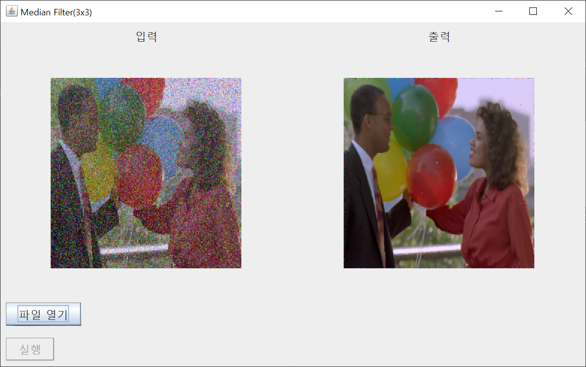

# SpatialFiltering



자바 Swing을 사용하여 만든 이미지 공간 필터입니다.

Mean Filter, Median Filter, Laplacian Filter, Log Filter를 사용할 수 있으며, 필터된 이미지를 보여줍니다.

## Getting Started / 어떻게 시작하나요?

Intellij로 프로젝트를 열고 프로젝트를 빌드하여 실행하시면 됩니다.

파일 선택에서 원하는 이미지를 선택하시면 됩니다.

### Prerequisites / 선행 조건

아래 사항들이 설치가 되어있어야합니다.

```
JDK 1.8 이상, Intellij
```

## Built With / 누구랑 만들었나요?

* [박세훈](https://github.com/psh3253) - 프로젝트 전체 설계 및 제작

## Function / 기능
+ Mean Filter(3x3, 5x5)
+ Median Filter(3x3, 5x5)
+ Laplacian Filter(3x3)
+ Laplacian Gaussian Filter(3x3)
+ 필터를 사용하여 Noise 제거 및 Edge 향상

## Technology / 기술

+ Swing을 사용하여 GUI 구현

## License / 라이센스

이 프로젝트는 GPL-3.0 라이센스로 라이센스가 부여되어 있습니다. 자세한 내용은 LICENSE 파일을 참고하세요.